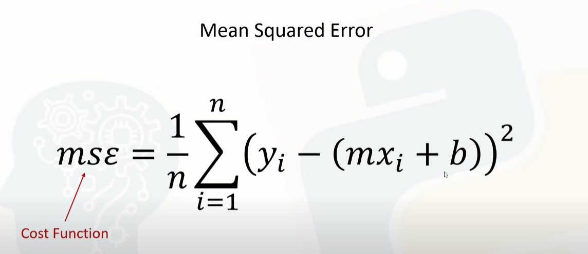
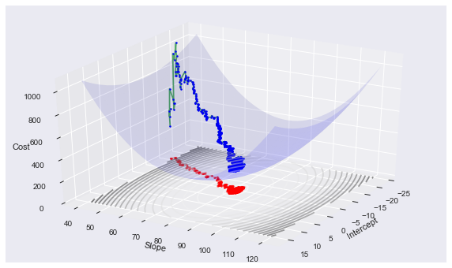
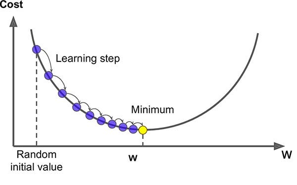
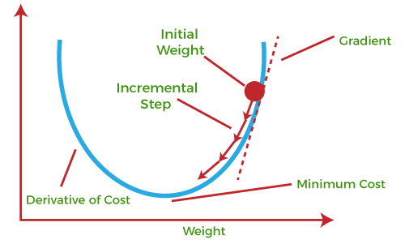
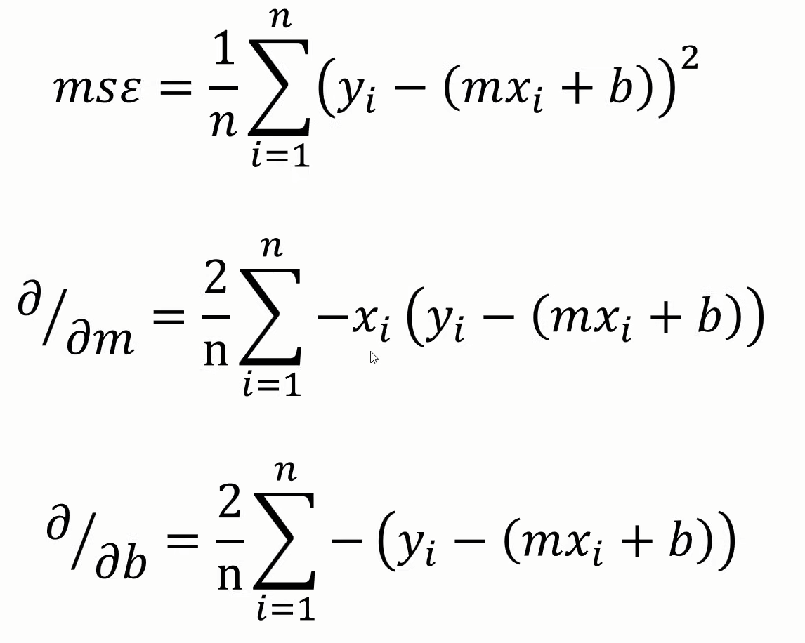

# Cost Function
- The cost function tells us how well our model is performing. Specifically, it measures the difference between the predicted values and the actual values. 
  
- The goal is to minimize this difference, which means we want a model that makes accurate predictions.
  
- For linear regression, the most commonly used cost function is the Mean Squared Error (MSE):

    ```py
    MSE = 1/n * sum(y1 - y(predicted))
    ``` 
    

# Gradient Descent

- A gradient descent is an ***algorithm that finds the best fit line for a given training dataset***.

- It is an iterative algorithm that finds the **minimum of a function by taking small steps in the direction of the negative gradient (slope)**.
   
- In the context of linear regression, it helps us find the best values of the parameters that minimize the cost function.

    

    

    


-  Gradient descent is ***calculated by taking derivative of that slope*** and similarly we can perform partial differentiation in the slope and the formulas are as follows:
  
    
